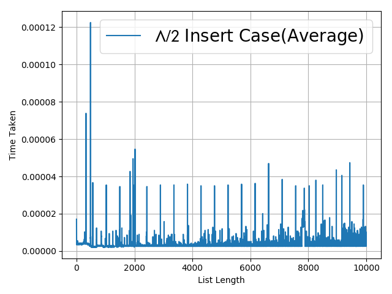
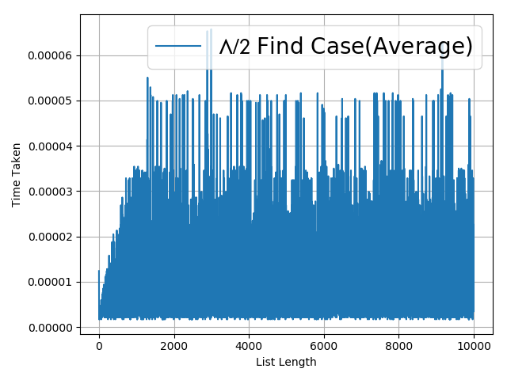
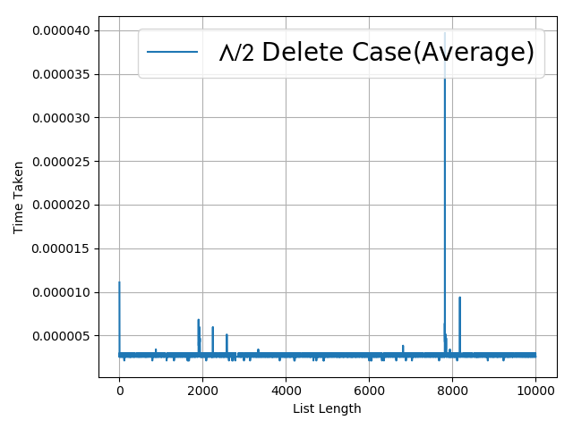
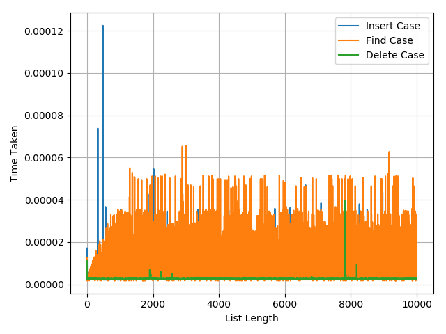
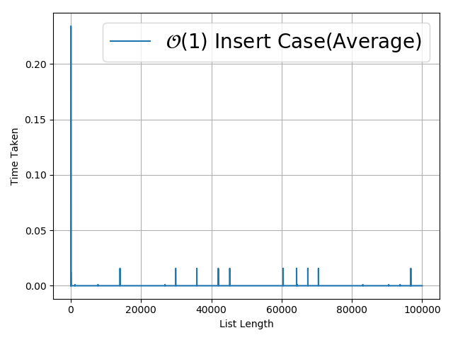
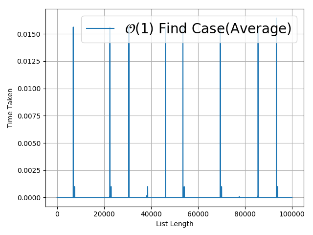
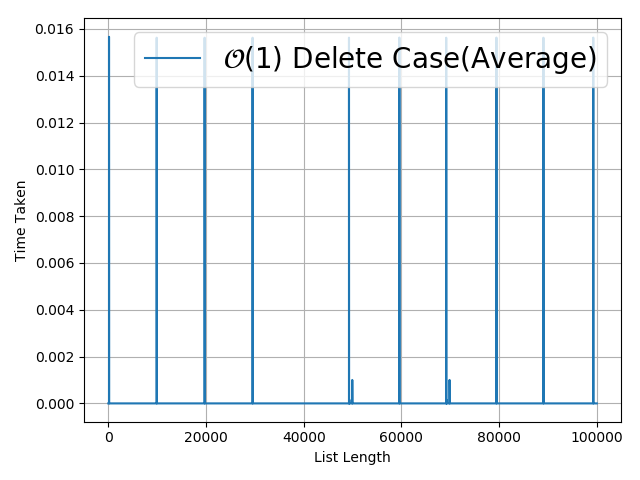
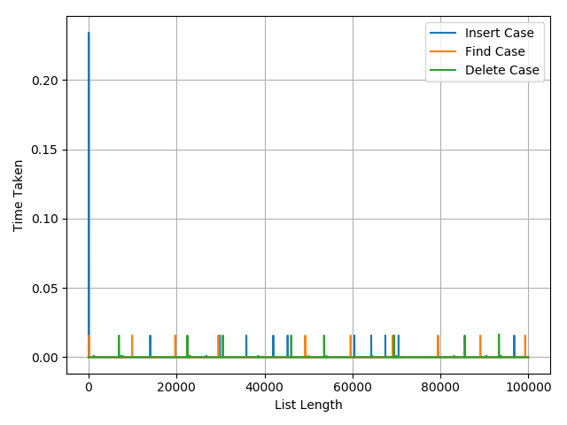

# HashTable
hash table using chaining and double hashing

Research of complexity of algorithms
In order to more detailed analysis of the properties of the provided algorithms, namely asymptotic complexity, and verification of the program for stability in the condition of processing large-size data, the main functions of the tables were measured, namely inserting, searching and deleting from the table and providing plots to func.

<h3>Analysis of table charts with Open Hashing (Chain Method).</h3>

The key index time processing is constant, O (1). After that, the search for the entry in the list begins. So, the time depends on the length of the list (the average length of the list λ.
 * Average.The average complexity of the operations of individual chains is O (λ). 
 * Worst.The average number of matches with the worst search result O (λ) (search by the end of the list).
 * Best λ / 2. 
# Insert

# Search 

# Delete 

# General Plot

<h3> Analysis of table charts with closed hashing (Double Hash Method). </h3> 
The time for calculating the key index is constant, O (1). 
This complexity of algorithms O (1) remains at the insertion , search , deletion.
The greatest time flow occurs during the rehash of the table and depends only on the size of the table itself (the average size of the table λ).

# Insert

# Search 

# Delete 

# General Plot

